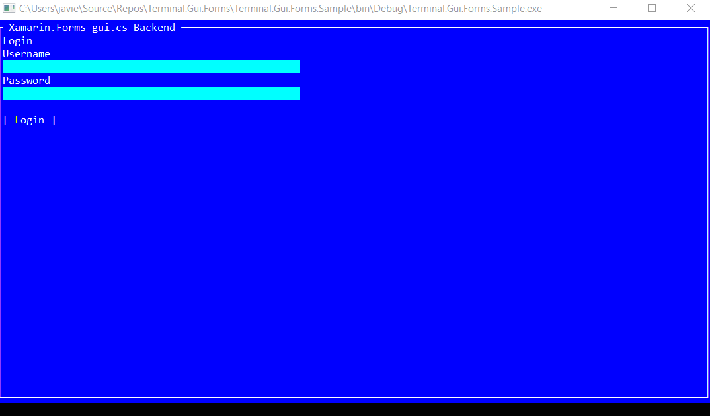

## Xamarin.Forms gui.cs Backend

[gui.cs](https://github.com/migueldeicaza/gui.cs) is a simple UI toolkit for .NET, .NET Core and Mono and works on both Windows and Linux/Unix created by [Miguel de Icaza](https://github.com/migueldeicaza).

This project is a small Xamarin.Forms backend of gui.cs. Yes, create **console** Apps with C# and XAML!.

## Copyright and license

Code released under the [MIT license](https://opensource.org/licenses/MIT).